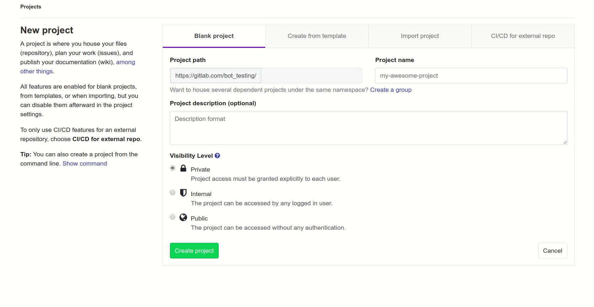
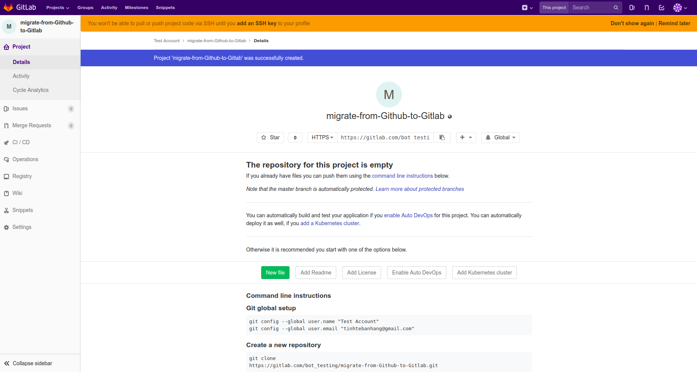
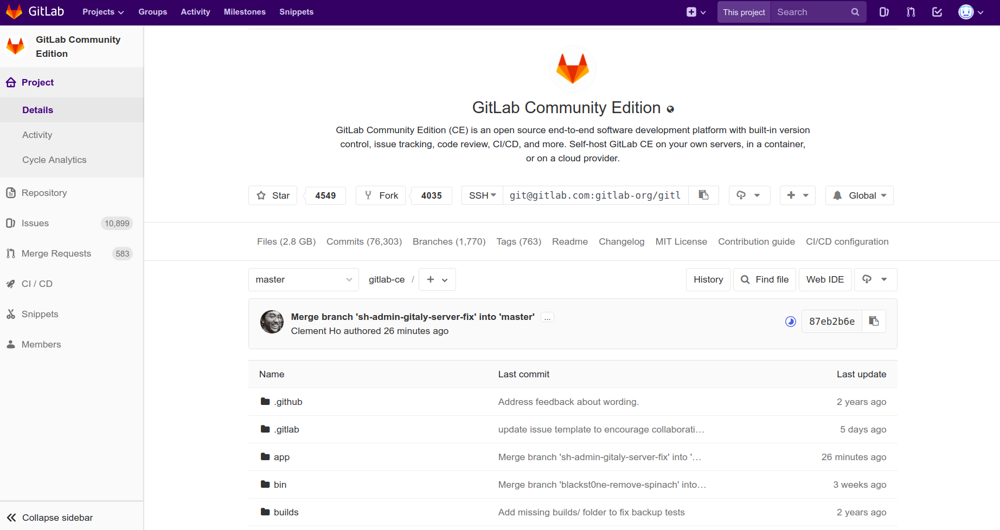
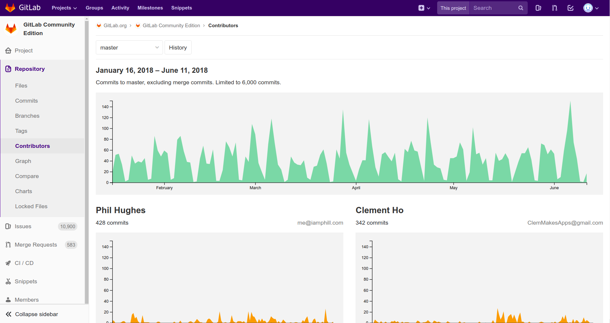
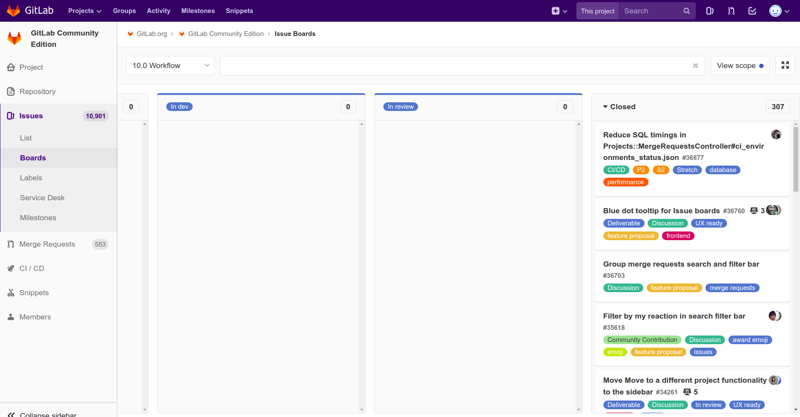
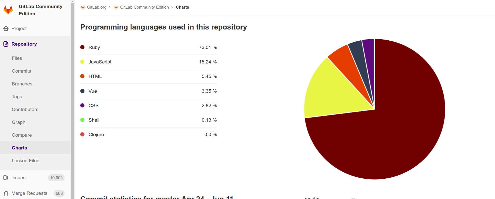

# A Short Gitlab Tutorial

First of all, I don't want to start a war between Github and Gitlab here. I don't care about the ethics of using Github nor the news that Microsoft bought Github recently. I write this guide for one obvious reason: **I want to migrate to Gitlab and help people in the same situation because thing seems a little bit different over there.**  

Secondly, I am not affiliated with Gitlab.  

Thirdly, I am utterly targeting **open source contributors** *and those of you who are too lazy to sign up for a Gitlab account to try it out*.  

It's gonna be concise (and maybe informal sometimes) so that you can kick off as soon as possible. In this guide, I am gonna assume that you are a basic Github user familiar with terms like Repo, Star, Pull Request... but not familiar with Github Enterprise or other "advanced" features of Github.  

> If you consider yourself highly mature in either of these platforms, this may not expose you to any new facts.(*although I would really appreciate your reading and reviewing it*)

Enough introduction, let's go!

## Seting up Gitlab
This is the screen after you have singed up and logged in succesfully. 

  

This dashboard is not similar to Github in UI, but the functionalities are pretty similar. Look at the top bar, you got Groups, Activity, Milestones... These are explainable on their own so I won't go deeper here. 

Some differences that should be noticed is:  
- **Pull request** => **Merge request** and displayed with this  icon.
- **Organisations** => **Group** as showned in  
- **Gits** => **Snippets** 

## Create your first new project  
While there are not much options for creating a new project(repository) on Github, there are a bunch of options to choose from, notably: 

#### Blank project 
You get three **levels of visibility**. Aside from the regularly seen **private** and **public**, they offer **internal**, which openess is limited to logged in user only.
#### Create from a template
Gitlab offers **Ruby on Rails, Spring and NodeJS Express** templates to start with. 
#### Import project from other services.
This is too easy an option. Gitlab already provided a [guide](https://docs.gitlab.com/ee/user/project/import/github.html) for it.
#### CI/CD for external repo
If you plan to use Gitlab as a CI/CD provider (like Jarvis, Circle CI), go for this and provide them a Github Token. There's also a [guide](https://gitlab.com/help/user/project/integrations/github) for this. 

  
*Above image shows a quick walkthrough* 

## Your first project page
After set up with blank project, this is what you get:
 

There are some important points to notice on this screen:  
1. **SSH key** - You have to set up one before you can push to Gitlab for security reason. (Gitlab uses SSH while Github uses HTTPs by default). It's easy and both Github and Gitlab provides a [guide](https://gitlab.com/help/ssh/README#generating-a-new-ssh-key-pair) to do it.  
2. **CI/CD and Operations** - Gitlab has these built in by default. Skip the following part if you don't care or never used CI/CD while in Github.  
  - If you are using one CI/CD system on Github (*like Travis, CircleCI, .etc*) this is pretty much the same. Builds are defined in a `.yml` file and Gitlab has a specific [guide](https://gitlab.com/help/ci/quick_start/README) on this.  
  - Operations are you integrate your app with Kubernetes (*via Google Cloud Platform*) so that deployments can be done automatically and environmentally-wise. Gitlab also got a [guide](https://gitlab.com/help/user/project/clusters/index) for this.  
  - AFAIK, Gitlab doesn't receive support from Travis/CircleCI on their platform. Some other CI services like Atlassian Bamboo or DroneCI works.
3. **Registry** - Again, I am not sure if you ever worked with containers, but if you know what DockerHub or Amazon ECR is, this one is the Gitlab version of them.  

Everything else is similar to what Github offers. 

#### Advance

Yeah I do hide a lot of the powers that Gitlab gives us. If you feel curious, head to the setting part, here's a simple list of things that you can tweak on Gitlab but not on Github:  
- Visibility of literally everything, from issues to merge requests...
- Project avatar ( ͡° ͜ʖ ͡°)
- Activate Service Desk (*yeah it's help desk for your project...*)
- Export everything.
- Choose integrations with a bunch of other services like Slack, Pivotal Tracker, Asana...
- ....

## Explore other projects and Contribute

I bet you will feel overwhelmed when seeing other projects's page for the first time. 

This is a perfect example for a project host on Gitlab: Gitlab itself. From the screenshot, you can criticise them for poluting your mind with buttons, titles, buttons. It would be a total difference if you look at this https://github.com/gitlabhq/gitlabhq then come back to Gitlab's page.  
But I believe it's not too hard to get familiar with. If you spend 15 seconds on this page, you will get the idea of what's going on. I just want to list out things that you might not see in that 15 seconds:
- Issues and Merge Requests are moved to the sidebar
- To create a pull request or issue you click that `+` button beside the `global` button, which is equivalent to `watch` on Github.(*but with more options*)
- Commits are inside `history` button.
- The equivalence of Github's Insight is inside `Repostiory`. For example:  
  
- The equivalence of Github's Project is inside `Issues`. For example:  
  
- To view the project's programming language, you head into `Repository>Charts` (1 more click than Github).  
  
  
Everything else works just like Github or with some supplements (for example: subscribe to issues via RSS).

The contribution flow is also the same : Fork > Edit > New Merge Request  
 

## Summary  

By now, you must have been aware of how things work the Gitlab way and what Gitlab has to offer. I really hope that this ease your way to Gitlab without hiding too much Gitlab power. Gitlab itself has cool things to be discovered, not just a mirror for other services like Github :).