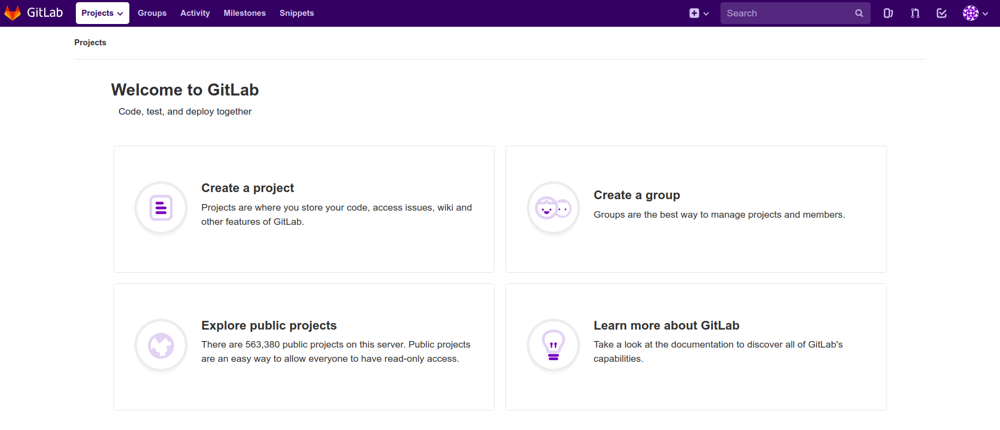

# How to migrate from Github to Gitlab  

First of all, I don't want to start a war between Github and Gitlab here. I don't care about the ethics of using Github nor the news that Microsoft bought Github recently. I write this guide for one obvious reason: **I want to migrate to Gitlab and I want to help people in the same situation because the workflow seems a little bit different over there.**

It's gonna be concise (and maybe informal sometimes) so that you can kick off as soon as possible. In this guide, I am gonna assume that you are a basic Github user familiar with terms like Repo, Star, Pull Request... but not familiar with Github Enterprise or other "advanced" features of Github. *Yes, I am utterly targeting open source contributors*. If you consider yourself highly mature in either of these platforms, this may not expose you to any new facts.(*although I would really appreciate your reading and reviewing it*)

Enough introduction, let's go!

## Seting up Gitlab
This is the screen after you have singed up and logged in succesfully. 

  

This dashboard is not similar to Github in UI, but the functionalities are pretty similar. Look at the top bar, you got Groups, Activity, Milestones... These are explainable on their own so I won't go deeper here. 

Some differences that should be noticed is:  
- **Pull request** => **Merge request** and displayed with this  icon.
- **Organisations** => **Group** as showned in  
- **Gits** => **Snippets** 

## Creating a new project  
While there are not much options for creating a new project(repository) on Github, there are a bunch of options to choose from, notably: 

### Blank project 
You get three **levels of visibility**. Aside from the regularly seen **private** and **public**, they offer **internal**, which openess is limited to logged in user only.
### Create from a template
Gitlab offers **Ruby on Rails, Spring and NodeJS Express** templates to start with. 
### Import project from other services.
This is too easy an option. Gitlab already provided a [guide](https://docs.gitlab.com/ee/user/project/import/github.html) for it.
### CI/CD for external repo
If you plan to use Gitlab as a CI/CD provider (like Jarvis, Circle CI), go for this and provide them a Github Token. There's also a [guide](https://gitlab.com/help/user/project/integrations/github) for this. 

  
*A quick walkthrough* 

After set up with blank project, this is what you get:
 

There are some important points to notice on this screen:  
1. You have to setup SSH key before you can push to Gitlab for security reason. (Github skips this by default and ask you for github email + password instead). It's easy and both Github and Gitlab provides a [guide](https://gitlab.com/help/ssh/README#generating-a-new-ssh-key-pair) to do it.  

